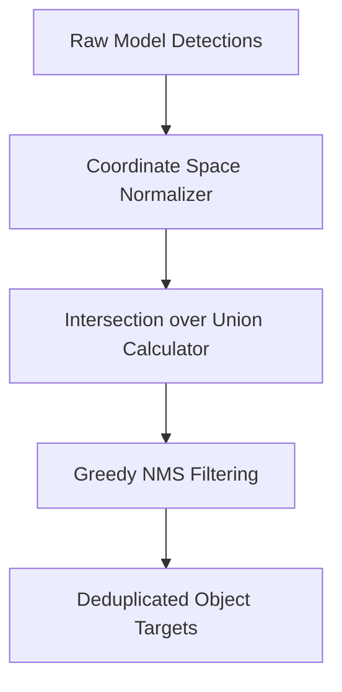

# genpark-bounding-box-iou-coordinate-normalizer-skill

Bounding box normalizer and Non-Maximum Suppression (NMS) engine computing IoU overlaps and coordinate space mappings.

## Architecture

## Features
- **Flexible Coordinate Formats**: Supports `[0, 1]`, `[0, 1000]`, and absolute pixels.
- **Fast IoU & NMS**: Pure Python implementation with zero C/torch dependencies.
